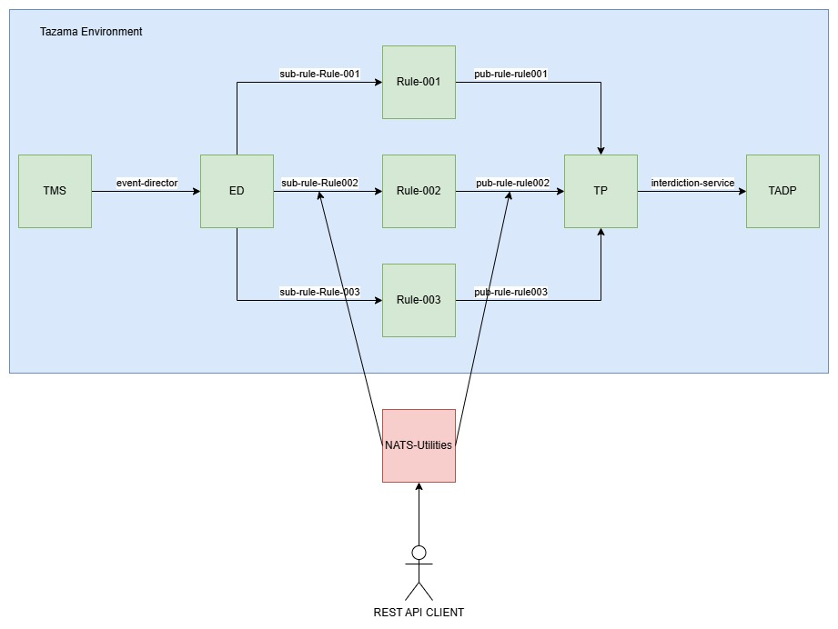

<!-- SPDX-License-Identifier: Apache-2.0 -->

# Nats Utilities

This Utilities application is used to interact with the nats messaging queue used by Tazama. Due to the fact that Tazama uses a message queue internaly, you cannot interact with any processors directly. This nats-utilities allow you to connect to the message queue system via rest api, and submit messages to the diffrent queues (Subjects).

# Main Use Case

Example - If you want to run a test on rule-002 to ensure it's functioning as expected you would like to send a message to the rule-002 subject, and intercept the message rule-002 sends onwards.



Your Request will look like:

Available on the path `natsPublish`.

Supported method: `POST`
Message body:

```json
{
  "message": {},
  "destination": "sub-rule-Rule002",
  "natsConsumer": "pub-rule-Rule002",
  "functionName": "Rule-002",
  "awaitReply": true
}
```

# Fire and Forget Use Case

Should you want to kick off the process at a certain point in the system, and NOT wait for a response you can tweak your request to do just that.


Available on the path `natsPublish`.

Supported method: `POST`
Message body:

```json
{
  "message": {},
  "destination": "sub-rule-Rule002",
  "natsConsumer": "pub-rule-Rule002",
  "functionName": "Rule-002",
  "awaitReply": false
}
```

# TMS Publish Use Case

Should you want to kick off the process from the start point (TMS) and intercept it somewhere along the process to see how the data would look, you will send directly to the TMS and provide a interception point.


Available on the path `restPublish`.

Supported method: `POST`
Message body:

```json
{
  "transaction": {},
  "endpoint": "http://localhost:5000",
  "natsConsumer": "interdiction-service",
  "functionName": "TMS",
  "awaitReply": true
}
```

# Flow Diagram

This application is an HTTP wrapper around Tazama's NATS implementation. At a very high level, this means you can send NATS messages to Tazama processors by sending an HTTP request to this service.


The application has two endpoints. One for NATS, and another for REST.

## Endpoints

`/` - Accessible with a `GET` method. - Provides a health check
`/health` - Accessible with a `GET` method. - Provides a health check

### NATS

Available on the path `natsPublish`
Unless if working with the TMS-API (this processor expects an HTTP request), this is the endpoint you would use in your requests.

Available on the path `natsPublish`.

Supported method: `POST`
Message body:

```json
{
  "message": {},
  "destination": "sub-rule-Rule002",
  "natsConsumer": "pub-rule-Rule002",
  "functionName": "Rule-002",
  "awaitReply": true
}
```

Message - This the incomming message for the processor. Your Rulerequest, Typologyrequest, etc.  
Destination - This is the Subject you are trying to send your request to. (Input)  
NatsConsumer - This will be the Subject you are listening to for a response. (Output)  
FunctionName - Used for the persistent name of the Subject. This is the name of the processor you are testing.  
AwaitReply - Whether or not you are awaiting the response.

### REST

Available on the path `restPublish`.

Supported method: `POST`
Message body:

```json
{
  "transaction": {},
  "endpoint": "",
  "natsConsumer": "",
  "functionName": "",
  "awaitReply": true
}
```

Transaction - This will be your Transaction. In most cases this will be a Pacs002.  
Endpoint - Your TMS URL where the transaction should be submitted. (Input)  
NatsConsumer - This will be the Subject you are listening to for a response. (Output)  
FunctionName - Used for the persistent name of the Subject. This is the name of the processor you are testing. (TMS)  
AwaitReply - Whether or not you are awaiting the response.

When targeting the TMS-API, you would want to use this endpoint.
